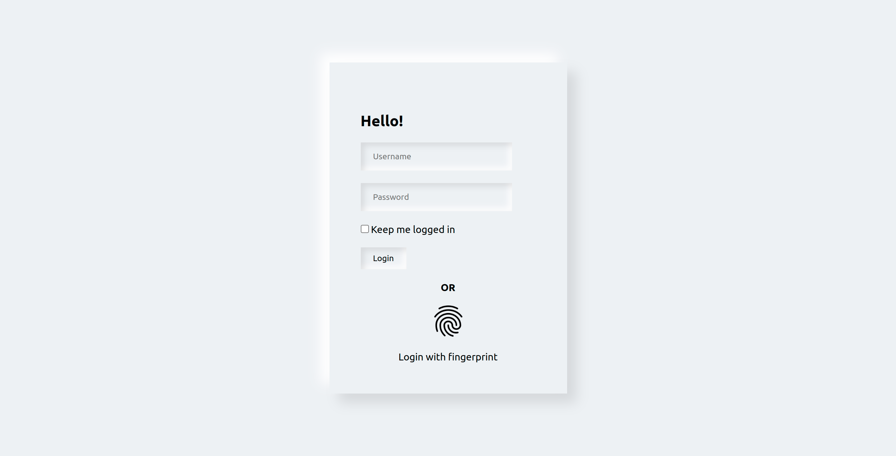

# Login Page Design With Biometrics

Simple UI design of a login page with the fingerprint option

# Final Outlook



---
# HTML 

```html

<body>
    <div class="login">
        <form action="">
            <h2>Hello!</h2>
            <div class="inputbox">
                <input type="text" placeholder="Username">
            </div>
            <div class="inputbox">
                <input type="password" placeholder="Password">
            </div>
            <label >
                <input type="checkbox" >
                <span>Keep me logged in</span>
            </label>
            <div class="inputbox">
                <input type="submit" value="Login">
            </div>
        </form>
        <div class="fingerprint">
            <h4>OR</h4>
            <div class="fingerprintbox">
                
            </div>
            <div class="fingerprinttext">
                <p>Login with fingerprint</p>
            </div>
        </div>
    </div>
</body>


```
---
```css
*{
    margin: 0;
    padding: 0;
    box-sizing: border-box;
    font-family: serif;
}
:root{
    --bg:#edf1f4;
}
body
{
    display: flex;
    min-height: 100vh;
    align-items: center;
    justify-content: center;
    background: var(--bg);
}
.login
{
    width: 380px;
    padding: 80px 50px 50px;
    display: flex;
    justify-content: center;
    flex-direction: column;
    box-shadow: 15px 15px 20px rgba(0,0,0,0.1),
    -15px -15px 20px #fff;
    gap: 20px;
}
form{
    width: 100%;
}

.login form h2{
    padding-bottom: 20px;
}

.login form .inputbox input{
    border: none;
    background: transparent;
}
.login form .inputbox input[type="text"],
.login form .inputbox input[type="password"]
{
    padding: 15px 20px;
    margin-bottom: 20px;
    box-shadow: inset 5px 5px 10px rgba(0,0,0,0.1),
    inset -5px -5px 10px #fff;
}

.login form .inputbox input[type="submit"]

{
    box-shadow: inset 5px 5px 10px rgba(0,0,0,0.1),
    inset -5px -5px 10px #fff;
    padding: 10px 20px;
    margin-top: 20px;
    cursor: pointer;
}

.fingerprint
{
    display: flex;
    align-items: center;
    justify-content: center;
    flex-direction: column;

}

.fingerprintbox{
    padding: 20px 0;
}

.fingerprintbox img{
    width: 50px;
    height: 50px;
    cursor: pointer;
}
```

---
